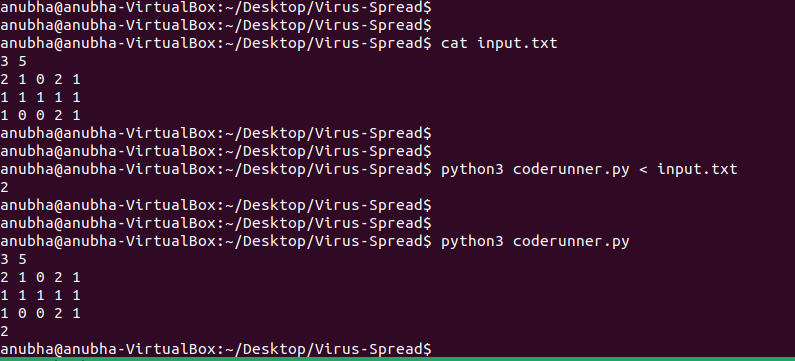
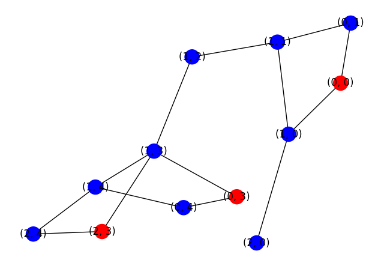

# Problem Statement
<details>
<summary> Click to expand</summary>
There is a virus spreading at the General Hospital. The hospital has an array of M x N wards, where M is the number of rows and N the number of columns. Each ward can be empty or have multiple patients. Each cell in the matrix can have a value of 0, 1 or 2 with the following meaning:

* The ward is empty
* The ward has uninfected patients
* The ward has infected patients

The infection can spread from an infected ward to an uninfected one only up, down, left and right in the matrix of wards during one unit of time. Empty wards cannot propagate the infection. Develop a program to help determine the minimum units of time after which all patients will be infected at the hospital. If all patients are not infected after an infinite amount of time, then return –1.
</details>

## Execution
### Requirements: Python3

```
pip install -r requirements.txt
python3 coderunner.py
```



## Files

* coderunner.py -> Executes the code. Enter input directly. It does not give any output prior to input.
* virusSpread.py -> Contains the methods and classes.
* test.py -> Test cases for testing
* input.txt -> Sample input to be used in command line
* hospital.ipynb -> Python notebook showing Matrix method (outdated)
* virus_spread.ipynb -> Python notebook showing Graph method (outdated)

## Solution

There are two solutions:

### Matrix
This utilizes python libraries for faster execution.
* Data is stored in matrix.
* Matrix is chosen as boolean to avoid unnecessary arithmatic operations.
* Matrix is added to itself with 1 shift left, right, up, down to mimic spread.
* Numpy built-in methods are picked for better execution count, such as np.count_nonzero.

### Grid
This utilizes Netowrk Graph for much better and realistic representation.
Much slower though.
Data is stored in grid.
This allows future compatibility:
* It is 3d matrix consisting multiple floors in the building
* Some patients interact with more than 4 neighbors (such as hospital staff)
* Weighted lines can be used, for patients with lesser/greater spread.

Can use following snippet to view graph as well.

    data = [[2, 1, 0, 2, 1], [1, 1, 1, 1, 1], [1, 0, 0, 2, 1]]
    matrix = MatrixGenerator.generate(data, algo='grid')
    print(matrix.timer_till_all_infected())
    matrix.draw_graph()


